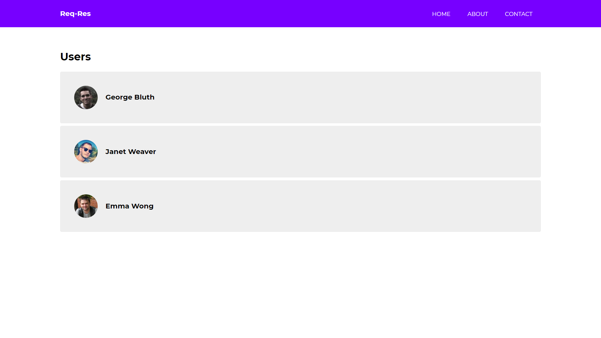

# angular-reqres

Work in progress..

<p align="center">✨A demo angular app for learning the Angular, TypeScript using ReqRes REST Api which returns fake data.✨</p>

Demo: 
    https://bharat-rajani.github.io/angular-reqres/
    
<p align="center"><br></p>

## Git Installation

```bash
# clone the repo
$ git clone https://github.com/bharat-rajani/angular-reqres.git

# change the working directory to angular-reqres
$ cd angular-reqres

# install the app
$ npm install

# run the server
$ npm serve -o
```

Open localhost:4200 on your browser.
